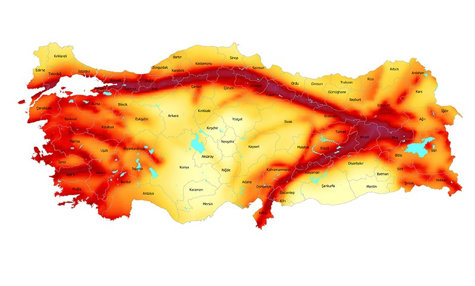

Welcome to our project page.

Here, you’ll find updates and insights from our ongoing exploration of earthquake patterns in Turkey.

# 1. Project Overview and Scope

Earthquakes remain one of the most pressing natural threats facing Turkey, a country intersected by several active fault lines—most notably the North Anatolian Fault Zone.
Understanding the spatio-temporal characteristics of seismic activity is crucial for disaster preparedness, urban planning, and seismic risk mitigation strategies.

This project focuses on analyzing the **temporal trends** and **regional distribution** of earthquakes that occurred in Turkey between **1975 and 2023**, using an openly accessible dataset published by the United States Geological Survey (USGS).
The dataset includes thousands of seismic events, each detailed with attributes such as time, location, magnitude, and depth, all confined within Turkey’s geographic boundaries (26°–45° E and 36°–42° N).

The primary research question driving this project is:

> **"How have earthquake frequency and magnitude changed in Turkey over time, and which regions show consistently higher seismic activity based on historical data?"**

{fig-align="center"}

To answer this question, the project sets the following objectives:

-   **Temporal Analysis**: Track annual or seasonal shifts in earthquake frequency and intensity.
-   **Spatial Mapping**: Visualize the geographic clustering of earthquakes to identify high-risk zones.
-   **Magnitude Patterns**: Investigate the distribution of magnitudes and how often stronger quakes occur.
-   **Risk Identification**: Identify areas of Turkey that exhibit consistently high seismic activity and may require closer monitoring or mitigation efforts.
-   **Visualization**: Produce clear and informative visualizations, including histograms, time series plots, and density maps, to support interpretations.

All analyses are performed in **R**, and the project is compiled and shared through a **Quarto-powered GitHub page**, making it fully transparent and reproducible.
The final product is intended to be both informative and accessible to audiences interested in Turkey’s seismic landscape—whether in research, policy, or planning.

# 2. Data

Understanding the nature of seismic activity in Turkey requires a data-driven approach built on reliable, long-term records.
This project builds on a dataset that spans almost three decades, offering a broad view of how seismic behavior has unfolded in different parts of Turkey.
It allows not only for time-based comparisons, but also for mapping out regions with higher seismic exposure—making it an ideal foundation for exploratory and risk-focused analysis.

## 2.1 Data Source

The dataset used in this project was obtained from the [USGS Earthquake Catalog](https://earthquake.usgs.gov/earthquakes/search/), a widely used open-access platform that provides detailed global seismic activity records.
For this project, we filtered the data to include only earthquakes that occurred within the borders of Turkey — specifically between 26°–45° Eastern longitudes and 36°–42° Northern latitudes — between the years 1975 and 2023.
Additionally, only events with a magnitude of 2.0 or greater were included to focus on perceptible and potentially damaging seismic activity.

The dataset was downloaded in `.csv` format and contains information such as:

-   **Date and Time** of the earthquake\
-   **Magnitude**\
-   **Depth (in kilometers)**\
-   **Latitude and Longitude**\
-   **Place** (a descriptive region name)

After downloading, the data was imported into R for further exploration and preprocessing.

## 2.2 General Information About Data

The dataset consists of approximately **30,000 earthquake events** recorded in Turkey over a **28-year period**.
Each row in the dataset corresponds to a unique seismic event, with detailed information such as the time it occurred, its geographical coordinates, how deep it originated, and how strong it was.
Most earthquakes are naturally concentrated around Turkey’s well-known fault zones, such as the North Anatolian Fault in the north and the East Anatolian Fault in the southeast.
This spatial clustering is something we aim to explore visually in the later sections of the project.

Here's a brief overview of the variables:

-   `time`: Timestamp of the earthquake (UTC), including date and hour\
-   `latitude` & `longitude`: Geographic location of the event\
-   `depth`: Depth below the surface in kilometers\
-   `mag`: Magnitude on the Richter scale\
-   `place`: Descriptive label provided by USGS, such as nearby city or region

Overall, The structure of the dataset is tidy and consistent, which makes it easier to analyze without extensive restructuring.
Thanks to its clean structure, the dataset served as an effective and convenient entry point for our analysis.

## 2.3 Reason of Choice

There are several reasons why we chose this specific dataset:

-   First and foremost, earthquakes have always been a critical topic in Turkey, especially following the devastating seismic events in 1999 and more recently in 2023. Understanding patterns in historical data can offer valuable insights into risk mitigation.
-   Second, the dataset is both **rich** and **clean**, and doesn't require extensive preprocessing to begin analysis. It offers a long temporal range (1975–2023), which makes it ideal for trend detection.
-   Lastly, We wanted a dataset that is directly relevant to public safety and urban planning in Turkey. The output of this study could contribute to further academic or policy-oriented discussions about seismic preparedness.

## 2.4 Preprocessing

After importing the CSV file into R, several preprocessing steps were performed to prepare the dataset for analysis:

-   **Datetime Conversion**: The `time` column was converted into proper POSIXct format to enable time-based analysis.
-   **Filtering**: Earthquakes below magnitude 2.0 were excluded, since they are too weak to be of concern in a risk-focused study.
-   **Region Extraction**: The `place` column was parsed to extract province-level identifiers where possible.
-   **Derived Variables**: A `year` column was created from the datetime to allow annual comparisons.
-   **Missing Values**: The dataset contained minimal missing data, which were either filtered out or imputed where reasonable.

The cleaned dataset was saved in `.RData` format for reproducibility and faster processing in future sessions.

```{r}
eq_data <- read.csv("turkey_earthquake_data.csv")
eq_data$DateTime <- as.POSIXct(eq_data$time, format="%Y-%m-%dT%H:%M:%OSZ", tz="UTC")
eq_data <- subset(eq_data, mag >= 3.0)
eq_data$year <- format(eq_data$DateTime, "%Y")
eq_data <- eq_data[ , !(names(eq_data) %in% c("magType", "nst", "gap", "dmin", "rms", 
                                              "net", "id", "updated", "type", 
                                              "horizontalError", "depthError", 
                                              "magError", "magNst", "status"))]
save(eq_data, file="eq_data.RData")
```

### Sample of the Cleaned Dataset

The table below presents the first few rows of the cleaned earthquake dataset used in this study.
After filtering out earthquakes below magnitude 3.0 and removing irrelevant columns, the dataset now includes key attributes such as date, location, magnitude, and depth.
This refined structure allows for a more focused analysis of significant seismic activity in Turkey from 1975 to 2023.

```{r}
library(knitr)

# İlk 10 satırı daha düzgün biçimli tablo olarak göster
kable(head(eq_data, 10), caption = "Table 1: Sample of Pre-processed Earthquake Data")
```

# 3. Analysis

In this part of the project, we carefully examined the earthquake data to identify patterns and trends related to seismic activity in Turkey.
We began by exploring the dataset to understand its overall quality and key characteristics, analyzing the distribution of earthquake magnitudes and depths, checking for any missing or unusual data, and preparing the data for further analysis.
Next, we investigated how earthquake occurrences have evolved over time by grouping events by year to observe changes in frequency and strength over the 28-year period.
Simultaneously, we mapped the spatial distribution of earthquakes across Turkey, which allowed us to pinpoint regions with higher seismic activity and identify clusters of frequent events.
We also examined potential relationships between variables, such as the correlation between earthquake depth and magnitude.
Finally, we applied clustering techniques and created heatmaps to highlight areas with intensified seismic activity.
These visualizations helped us identify zones that might require closer monitoring or risk mitigation.
Throughout the analysis, we utilized the R programming language and specialized packages for geospatial data handling and visualization.
Our findings lay a foundation for more advanced seismic risk modeling and provide valuable insights for researchers and policymakers interested in Turkey’s earthquake patterns.

## 3.1 Exploratory Data Analysis

In this section, we will conduct an exploratory analysis of the earthquake data to understand its basic structure and identify potential patterns or issues.

### 3.1.1 Overview of the Dataset

The dataset includes information on earthquakes that occurred in Turkey from 1975 to 2023, filtered to include only events with a magnitude of 3.0 or higher.
After preprocessing, the dataset consists of the following key columns:

-   **DateTime**: The exact date and time of each earthquake (in UTC).
-   **latitude**: The north–south coordinate of the event.
-   **longitude**: The east–west coordinate of the event.
-   **depth**: The depth of the earthquake’s focus, in kilometers.
-   **mag**: The magnitude of the earthquake, based on the Richter scale.
-   **place**: A textual description of the location, such as nearby towns or provinces.
-   **year**: Extracted from the date, useful for time-series grouping.

The dataset is structured in a tidy format with no missing values in the key analytical fields.

```{r}
sum(is.na(eq_data))
```

## 3.2 Visualization and Analysis

Understanding the distributions of key variables gives insight into the data’s characteristics and helps identify any anomalies or patterns.

<strong><u>Earthquake Magnitude Distribution</u></strong>

The magnitude of earthquakes is fundamental to assessing seismic risk.
This histogram shows how often different magnitude values occur in the dataset.

```{r}
library(ggplot2)
ggplot(eq_data, aes(x = mag)) +
  geom_histogram(binwidth = 0.2, fill = "#7686A3", color = "black") +
  labs(title = "Distribution of Earthquake Magnitudes",
       x = "Magnitude", y = "Frequency")
```

<strong><u>Earthquake Depth Distribution</u></strong>

Depth indicates how deep beneath the surface an earthquake originates.
This histogram helps us understand the typical depth range of earthquakes in Turkey.

```{r}
ggplot(eq_data, aes(x = depth)) +
  geom_histogram(binwidth = 5, fill = "#99BAB6", color = "black") +
  labs(title = "Distribution of Earthquake Depths",
       x = "Depth (km)", y = "Frequency")
```

<strong><u>Earthquake Frequency Over Time</u></strong>

Next, we analyze how earthquake occurrences vary over the years.
This temporal view is crucial for detecting trends or changes in seismic activity.

```{r}
eq_data$year <- format(as.Date(eq_data$DateTime), "%Y")
earthquakes_per_year <- table(eq_data$year)

ggplot(data.frame(year = names(earthquakes_per_year), count = as.numeric(earthquakes_per_year)),
       aes(x = year, y = count)) +
  geom_bar(stat = "identity", fill = "#27394A") +
  theme(axis.text.x = element_text(angle = 90)) +
  labs(title = "Earthquake Frequency by Year",
       x = "Year", y = "Count")
```

<strong><u>Spatial Distribution of Earthquakes</u></strong>

Mapping earthquake epicenters provides spatial insights and helps identify regions of concentrated seismic activity.

```{r, fig.width=7, fig.height=5}
library(ggplot2)
library(sf)

turkey_shapefile <- st_read("/Users/akbulut/Documents/GitHub/emu660-spring2025-edagrlk/turkey.shp")

ggplot() +
  geom_sf(data = turkey_shapefile, fill = "white", color = "black") +
  geom_point(data = eq_data, aes(x = longitude, y = latitude, color = mag), alpha = 0.5) +
  scale_color_viridis_c(option = "inferno", direction = -1) +
  coord_sf(xlim = c(26, 45), ylim = c(36, 42), expand = FALSE) +
  labs(title = "Spatial Distribution of Earthquakes in Turkey",
       x = "Longitude", y = "Latitude", color = "Magnitude") +
  theme_minimal()      
```

### 3.2.1. Spatial Distribution of Earthquakes in Turkey: Top 10 Years by Frequency

This set of maps shows where earthquakes happened during the ten years when Turkey experienced the most seismic activity.
By looking closely at these particularly busy years, we get a clearer picture of how earthquake epicenters spread across different parts of the country during times of higher activity.

On each map, the earthquakes are colored according to their strength, making it easy to spot the bigger and more powerful ones.
We also made sure that earthquakes with a magnitude greater than 5 stand out by showing them as larger points, so their importance isn’t missed.

These maps help us see patterns and clusters where earthquakes tend to happen more often during these busy years.
Understanding these hotspots is really important for evaluating risks and planning safety measures in the areas that need it the most.

```{r}
library(ggplot2)
library(sf)

turkey_shapefile <- st_read("/Users/akbulut/Documents/GitHub/emu660-spring2025-edagrlk/turkey.shp")

top10_years <- names(sort(table(eq_data$year), decreasing = TRUE))[1:10]

for (yr in top10_years) {
  eq_year <- subset(eq_data, year == yr)
  
  cat("\n\n### Earthquake Distribution for Year:", yr, "\n\n")
  
  print(
    ggplot() +
      geom_sf(data = turkey_shapefile, fill = "white", color = "black") +
      geom_point(data = eq_year,
                 aes(x = longitude, y = latitude, color = mag),
                 alpha = 0.6,
                 size = ifelse(eq_year$mag > 5, 5, 2)) +  # 5'ten büyükse 5, değilse 2
      scale_color_viridis_c(option = "inferno", direction = -1) +
      coord_sf(xlim = c(26, 45), ylim = c(36, 42), expand = FALSE) +
      labs(title = paste("Spatial Distribution of Earthquakes in Turkey - Year:", yr),
           x = "Longitude", y = "Latitude", color = "Magnitude") +
      theme_minimal()
  )
}
```

The earthquake dataset used in this study reliably captures the spatial and temporal distribution of seismic events across Turkey, including some of the country’s most significant and devastating earthquakes.
Notably, large earthquakes such as the 1999 İzmit earthquake, the 2023 Kahramanmaraş earthquake, the 1995 Dinar earthquake, and the 2005 Bingöl earthquake are clearly represented with corresponding high-magnitude events and dense epicenter clusters in the respective years.

This realistic portrayal strengthens the credibility of the data, as it aligns well with well-documented seismic history and major catastrophe timelines.
Such consistency supports the use of this dataset for both analytical insights and risk assessment applications.

Regarding human and economic impacts, the following major earthquakes have been associated with severe consequences in terms of fatalities and structural damage:

| Year | Earthquake | Estimated Death Toll | Estimated Damage (in USD) | Source |
|-------------|-------------|-------------|-------------|---------------------|
| 1991 | Erzincan Earthquake | \~750 | Severe | [USGS](https://earthquake.usgs.gov/earthquakes/eventpage/usp0004xzn) |
| 1993 | Erzincan Earthquake | \~1500 | Severe | [EM-DAT](https://www.emdat.be) |
| 1994 | Marmara (Ladik) Earthquake | Minimal | — | — |
| 1995 | Dinar Earthquake | \~90 | Significant | [Kandilli Observatory](http://www.koeri.boun.edu.tr) |
| 1999 | İzmit Earthquake | \~17,000 | Estimated billions | [AFAD](https://www.afad.gov.tr), [USGS](https://earthquake.usgs.gov) |
| 2004 | Bolu-Gerede Earthquake | \~150 | Considerable | [EM-DAT](https://www.emdat.be) |
| 2005 | Bingöl Earthquake | \~176 | Major | [USGS](https://earthquake.usgs.gov) |
| 2006 | Düzce Earthquake | \~845 | Major | [AFAD](https://www.afad.gov.tr) |
| 2007 | Balıkesir Earthquake | Minimal | Moderate | [USGS](https://earthquake.usgs.gov) |
| 2023 | Kahramanmaraş Earthquake | \>50,000 | Massive | [ReliefWeb](https://reliefweb.int), [AFAD](https://www.afad.gov.tr) |

Note: The death tolls and damage estimates vary between sources but consistently highlight the catastrophic nature of these events.
Note: In 1994, an earthquake occurred in the Marmara region of Turkey.
Although it was a noticeable seismic event, it did not result in significant destruction or a high number of casualties compared to other major earthquakes in the country.
Therefore, its impact is considered minor relative to catastrophic events such as those in 1999 and 2023.

By cross-referencing our earthquake data with these well-documented events, we validate that the dataset effectively reflects the timing and intensity of Turkey’s major seismic disasters.
This allows us to confidently use it as a basis for spatial and temporal analyses as well as for informing risk mitigation strategies.

# 4. Results and Key Takeaways

When we looked at earthquakes in Turkey between 1975 and 2023, we wanted to understand not just how often they happened but also where they were most intense.
By combining the time and place of these events, we uncovered patterns that show which years were particularly active and which regions faced the most powerful shakes.
These findings help us get a clearer picture of earthquake risks in Turkey and can guide efforts to better prepare and protect communities.
Here are the main takeaways from our work: • This study takes a close look at the timing and locations of earthquakes in Turkey over nearly three decades, using detailed data from the USGS earthquake catalog.
• We found that certain years stood out with more earthquake activity, and we mapped these events to highlight hotspots with frequent and strong quakes.
• The dataset reflects real-life major earthquakes, like the devastating ones in 1999 and 2023, making our analysis grounded in actual seismic history.
• By spotting clusters of big earthquakes, we identified areas that might need extra attention when it comes to risk planning and disaster readiness.
• Overall, this work shows how looking at both when and where earthquakes happen can give a much better understanding of the risks, helping us take smarter steps to reduce them.

```         
*ChatGPT was utilized in this project.
```
